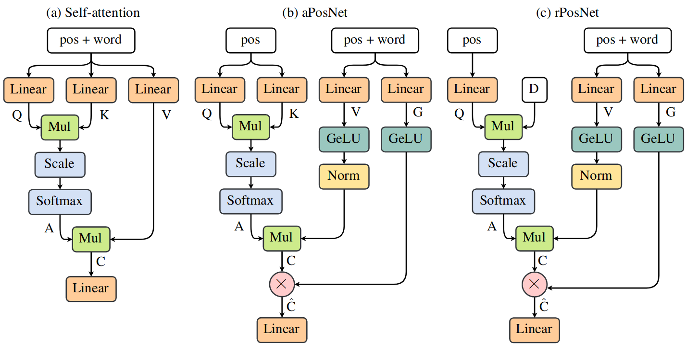

# PosNet: Bridging the Gap Between Position-Based and Content-Based Self-Attention for Neural Machine Translation

This is the official repository of the WMT23 paper [Bridging the Gap between Position-Based and Content-Based Self-Attention for Neural Machine Translation](http://www2.statmt.org/wmt23/pdf/2023.wmt-1.46.pdf).
The repository can be used to reproduce the results from the paper and to train new models for which it contains implementations of the [Transformer](https://arxiv.org/abs/1706.03762), [Transformer with relative position representations](https://arxiv.org/abs/1803.02155), [FNet](https://arxiv.org/abs/2105.03824), [GaussianNet](https://aclanthology.org/2020.acl-main.687/), [LinearNet](https://arxiv.org/abs/2105.01601), [gLinearNet](https://arxiv.org/abs/2105.08050), as well as our models aPosNet, and rPosNet.

The Figure below displays the architecture of a self-attention layer of aPosNet and rPosNet.
Their structure follows closely that of attention but replaces word embeddings with **a**bsolute and **r**elative position embeddings in the input of keys and queries.
Additionally, it wraps the weighted sum with a gating mechanism.
After training, the attention energies can be precomputed such that the mechanism reduces to a simple matrix multiplication.



## Install

### Requirements

We used the following configuration for our experiments. Please note that we cannot guarantee full functionality beyond those.

- Ubuntu 20.04
- Python 3.8
- Cuda 11.2
- CUDNN 11.2
- Open MPI 2.1.1

Make sure your path variables are set correctly before running the next steps (e.g. PATH, LD_LIBRARY_PATH).

### Install Poetry

Make sure to replace `<YOUR_POETRY_DIR>` with your path.

```bash
curl -sSL https://install.python-poetry.org | POETRY_HOME=<YOUR_POETRY_DIR> python3 -
```

Add poetry to your PATH variable:
```bash
export YOUR_POETRY_DIR/bin:$PATH
```

### Install Python Dependencies except Horovod

To create a virtual env and install all dependencies in it, run the following commands but replace `<YOUR_VENV_FOLDER>` with your path:
```bash
python3 -m venv <YOUR_VENV_FOLDER>
source <YOUR_VENV_FOLDER>/bin/activate
pip3 install --upgrade pip
poetry install
```

### Install Horovod

```bash
HOROVOD_WITH_PYTORCH=1 pip3 install --no-cache-dir horovod[pytorch]==0.24.3
```

## Data processing

Lets assume you clone this repository into
```bash
export POSNET=<YOUR_POSNET_DIR>
```

#### IWSLT.De-En

```bash
cd $POSNET/data/iwslt14/de-en
bash prepare.bash
find $POSNET/models -type f -name '*.iwslt.*.yaml' | xargs sed -i 's/YOUR_IWSLT/$POSNET\/data\/iwslt14/g'
```

#### WMT.En-De

```bash
cd $POSNET/data/wmt14/en-de
bash prepare.bash
find $POSNET/models -type f -name '*.wmt.en-de.*.yaml' | xargs sed -i 's/YOUR_WMT14/$POSNET\/data\/wmt14/g'
```

#### WMT.En-Fr

```bash
cd $POSNET/data/wmt14/en-fr
bash prepare.bash
find $POSNET/models -type f -name '*.wmt.en-de.*.yaml' | xargs sed -i 's/YOUR_WMT14/$POSNET\/data\/wmt14/g'
```

## Basic Usage

Before running the PytorchMT procedures (train/search) make sure that you add the path of the model you want to train to `$PYTHONPATH`:

```bash
export PYTHONPATH=${PYTHONPATH}:$POSNET/models/baselines/ # or
export PYTHONPATH=${PYTHONPATH}:$POSNET/models/posnet/
```

### Train

We summarized the procedure of starting the training in `$POSNET/scripts/train.bash`.
The script, and also the following scripts, take as kwarg input some paths which are user specific. Make sure to supply the correct paths but also to modify the task and model parameters defined inside of the script.
To train, make sure to **activate your venv** and run:
```bash
bash $POSNET/scripts/train.bash <OUTPUT_DIR> $POSNET
```
Here, `<OUTPUT_DIR>` points to a directory in which the procedure will store training logs and checkpoints and`$POSNET` is the same parameter as above which points to this directory.

Besides some logs and numbers, the primary outputs of the training process are the checkpoints.
Besides the epoch checkpoints, we generate an average over checkpoints over the last and following the best checkpoint at the end of training.
This checkpoint (or any other checkpoint) can then be used within the next step. 

Here is an overview of `pytorchmt/pytorchmt/train.py`:
```bash
usage: train.py [-h] --config CONFIG --output-folder OUTPUT_FOLDER [--resume-training RESUME_TRAINING] [--resume-training-from RESUME_TRAINING_FROM] [--number-of-gpus NUMBER_OF_GPUS]

optional arguments:
  -h, --help            show this help message and exit
  --config CONFIG       The path to the config.yaml which contains all user defined parameters.
  --output-folder OUTPUT_FOLDER
                        The folder in which to write the training output (ckpts, learning-rates, perplexities etc.)
  --resume-training RESUME_TRAINING
                        If you want to resume a training, set this flag to 1 and specify the directory with "resume-training-from".
  --resume-training-from RESUME_TRAINING_FROM
                        If you want to resume a training, specify the output directory here. We expect it to have the same layout as a newly created one.
  --number-of-gpus NUMBER_OF_GPUS
                        This is usually specified in the config but can also be overwritten from the cli.
```

### Search

To search a checkpoint we provide the script `$POSNET/scripts/search.bash`, which, at its core, calls `pytorchmt/pytorchmt/search.py`.
As the first argument you need to pass the checkpoint path, as the second the output folder, and as the third the `$POSNET` directory.
Similar to the train script make sure to modify the task and model parameter within the script.
Within the output folder specified this will create the unprocessed hypothesis file:
```bash
bash $POSNET/scripts/search.bash <CHECKPOINT_PATH> <OUTPUT_DIR> $POSNET
```

A summary of `pytorchmt/pytorchmt/search.py`:
```bash
usage: search.py [-h] --config CONFIG --checkpoint-path CHECKPOINT_PATH [--output-folder OUTPUT_FOLDER] [--number-of-gpus NUMBER_OF_GPUS]

optional arguments:
  -h, --help            show this help message and exit
  --config CONFIG       The path to the config.yaml which contains all user defined parameters. It may or may not match the one trained with. This is up to the user to ensure.
  --checkpoint-path CHECKPOINT_PATH
                        The checkpoint.pt file containing the model weights.
  --output-folder OUTPUT_FOLDER
                        The output folder in which to write the score and hypotheses.
  --number-of-gpus NUMBER_OF_GPUS
                        This is usually specified in the config but can also be overwritten from the cli. However, in search this can only be 0 or 1. We do not support multi-gpu decoding. If you set it to >1 we will set it back to 1 so that you dont need to modify the config in search.
```

### Evaluate

The script `$POSNET/scripts/eval.bash` contains the commands that we used to evaluate our hypotheses with respect to BLEU, BLEURT and COMET.
To run the script make sure you have installed the following repos [sacrebleu](https://github.com/mjpost/sacrebleu), [BLEURT](https://github.com/google-research/bleurt) and [COMET](https://github.com/Unbabel/COMET).
Then you can run
```bash
bash $POSNET/scripts/eval.bash <HYP_PATH> $POSNET
```
where `<HYP_PATH>` points to your hypotheses file from the search step.

## Cite

```bash
@InProceedings{schmidt-digangi:2023:WMT,
  author = {Schmidt, Felix  and  Di Gangi, Mattia},
  title = {Bridging the Gap between Position-Based and Content-Based Self-Attention for Neural Machine Translation},
  booktitle = {Proceedings of the Eighth Conference on Machine Translation},
  month = {December},
  year = {2023},
  address = {Singapore},
  publisher = {Association for Computational Linguistics},
  pages = {505--519},
  url = {https://aclanthology.org/2023.wmt-1.46},
  abstract  = {Position-based token-mixing approaches, such as FNet and MLPMixer, have shown to be exciting attention alternatives for computer vision and natural language understanding. The motivation is usually to remove redundant operations for higher efficiency on consumer GPUs while maintaining Transformer quality. On the hardware side, research on memristive crossbar arrays shows the possibility of efficiency gains up to two orders of magnitude by performing in-memory computation with weights stored on device. While it is impossible to store dynamic attention weights based on token-token interactions on device, position-based weights represent a concrete alternative if they only lead to minimal degradation. In this paper, we propose position-based attention as a variant of multi-head attention where the attention weights are computed from position representations. A naive replacement of token vectors with position vectors in self-attention results in a significant loss in translation quality, which can be recovered by using relative position representations and a gating mechanism. We show analytically that this gating mechanism introduces some form of word dependency and validate its effectiveness experimentally under various conditions. The resulting network, rPosNet, outperforms previous position-based approaches and matches the quality of the Transformer with relative position embedding while requiring 20\% less attention parameters after training.}
}
```